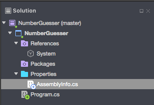

# C\#

## Introduction

Brief summary of programming in C#, in an attemp to get up to date with the language.

Since I mostly code in JavaScript and Java, expect it to be compared to these languages.

## Basics



We spot a file called, `Assemblyinfo.cs`, which is a config file, and will look like:

```cs
using System.Reflection;
using System.Runtime.CompilerServices;

// Information about this assembly is defined by the following attributes.
// Change them to the values specific to your project.

[assembly: AssemblyTitle("NumberGuesser")]
[assembly: AssemblyDescription("")]
[assembly: AssemblyConfiguration("")]
[assembly: AssemblyCompany("")]
[assembly: AssemblyProduct("")]
[assembly: AssemblyCopyright("${AuthorCopyright}")]
[assembly: AssemblyTrademark("")]
[assembly: AssemblyCulture("")]

// The assembly version has the format "{Major}.{Minor}.{Build}.{Revision}".
// The form "{Major}.{Minor}.*" will automatically update the build and revision,
// and "{Major}.{Minor}.{Build}.*" will update just the revision.

[assembly: AssemblyVersion("1.0.*")]

// The following attributes are used to specify the signing key for the assembly,  
// if desired. See the Mono documentation for more information about signing.

//[assembly: AssemblyDelaySign(false)]
//[assembly: AssemblyKeyFile("")]
```

We don't need to know much about it for now, just that it's there.
So, we will start with one main file and a main class, usually called `Program` or `MainClass`.

```cs
// Program.cs
using System;

// Namespace
namespace NumberGuesser
{
    // Main Class
    class MainClass
    {
        // Entry Point Method
        public static void Main(string[] args)
        {
            Console.WriteLine("Hello World!");
        }
    }
}
```

We see that, first, `namespace` shows up. It's a container for classes and functions, that by default is going to be named after our application, but can be changed. In the possible event that we have two classes or functions with the same name, we would reference its namespace to identify them.

On top of the file we see the `using` statements. These are bringing other namespaces with other functions. Similar to `import` in Java, o the modules in JavaScript.

```cs
using System;
using System.Collections.Generic;
using System.Linq;
using System.Text;
using System.Threading.Tasks;
```

Jumping to the `class` statement, inside the _namespace_, we see that similar to any OOP language, a **class** is used to create objects or instances.

Inside classes we have functions and variables, or `methods` and `properties`.

Jumping to the _Entry Point Method_, we see that similar to Java, `void` is a modifier that indicates that said function won't return any value. While `static` indicates that instead of creating objects from a class, we reference said class itself., not needing to instantiate an object to be able to use the methods of the class, for example.

### Writing in the Console

We have to main ways to write in the console:

```cs
Console.WriteLine("Hello Darkness");
Console.Write("My old friend");
```

- `.Write()` outputs one or more values to the screen withopur a new line character.
- `.WriteLine()` always appends a new line character to the end of the string. This means that any subsequent output will start on a new line.

Other methods we can find:

- `Console.ForegroundColor = ConsoleColor.Red`: changes the color of the text in the console.
- `Console.BackgroundColor...`: changes the bg color.
- `Console.ResetColor()`: Reset text color.
- `Console.ReadLine()`:

### Defining a variable

To define variables we do it similar to Java, defining the type first.

_Note:_ In Java, it's `String`, while in C#, `string`

```cs
string name = "Jose";
int number = 28;
```

### Concatenation

Similar to other languages, it'd looks like:

```cs
Console.WriteLine("Hello, my name is " + name);
```

But another way is:

```cs
string name = "Jose";
string adj = "handsome";
Console.WriteLine("{0} is {1}", name, adj); // Jose is handsome
```

### Random

```cs
Random rndm = new Random();
int number = rndm.Next(1, 11); // Random number from 1-10

```